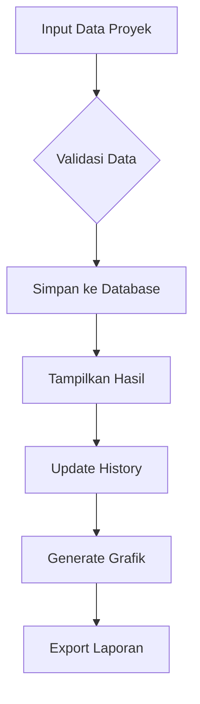
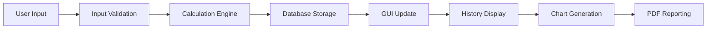

# 🏠 Kalkulator Cicilan Rumah

<div align="center">


**Aplikasi kalkulator cicilan rumah canggih dengan GUI modern, database history, dan fitur analisis lengkap**

[Fitur](#-fitur) • [Instalasi](#-instalasi) • [Penggunaan](#-penggunaan) • [Dokumentasi](#-dokumentasi) 

</div>

## 📋 Daftar Isi

- [Gambaran Umum](#-gambaran-umum)
- [Fitur](#-fitur)
- [Instalasi](#-instalasi)
- [Penggunaan](#-penggunaan)
- [Dokumentasi](#-dokumentasi)
- [Contoh Penggunaan](#-contoh-penggunaan)
- [FAQ](#-faq)

## 🚀 Gambaran Umum

**Kalkulator Cicilan Rumah** adalah aplikasi kalkulator finansial yang dirancang khusus untuk menghitung cicilan rumah dengan presisi tinggi. Aplikasi ini dilengkapi dengan antarmuka grafis modern, sistem penyimpanan database, analisis grafik, dan fitur reporting yang komprehensif.

### ✨ Highlights

- 🎨 **GUI Modern** dengan tema dark yang professional
- 💾 **Database SQLite** untuk penyimpanan history permanen
- 📊 **Visualisasi Data** dengan grafik analisis
- 📈 **Reporting System** export PDF otomatis
- 🧮 **Multiple Skema** cicilan (5, 10, 15, 20 tahun)
- 💰 **Format Currency** Indonesia yang rapi

## 🌟 Fitur

### 🧮 Core Calculator
- **Perhitungan Akurat** - Cicilan tahunan dan bulanan
- **Analisis Keuntungan** - Selisih harga dan persentase profit
- **Multiple Tenor** - 5, 10, 15, 20 tahun
- **Validasi Input** - Cek konsistensi data

### 💾 Data Management
- **SQLite Database** - Penyimpanan terstruktur
- **Auto-save History** - Setiap perhitungan tersimpan otomatis
- **History Management** - Lihat, hapus, dan kelola data
- **Backup Data** - Ekspor data ke format PDF

### 📊 Analysis & Reporting
- **Grafik Perbandingan** - Harga asal vs harga jual
- **Analisis Keuntungan** - Visualisasi profit per proyek
- **PDF Reporting** - Laporan profesional dengan ringkasan
- **Real-time Stats** - Statistik performa proyek

### 🎨 User Experience
- **Dark Theme** - Tema gelap modern dan eye-friendly
- **Responsive Design** - Adaptif berbagai ukuran layar
- **Input Validation** - Validasi data real-time
- **Currency Format** - Format Rupiah Indonesia
- **Tab Interface** - Navigasi yang intuitif


## 📥 Instalasi

### Prerequisites

- Python 3.7 atau lebih tinggi
- pip (Python package manager)

### Step-by-Step Installation

1. **Download Project**
   ```bash
   # Clone atau download project
   git clone https://github.com/username/super-calculator-cicilan.git
   cd super-calculator-cicilan
   ```

2. **Buat Virtual Environment (Recommended)**
   ```bash
   python -m venv calculator_env
   # Windows
   calculator_env\Scripts\activate
   # Linux/Mac
   source calculator_env/bin/activate
   ```

3. **Verifikasi Instalasi**
   ```bash
   python main.py
   ```

### Dependencies

```txt
matplotlib>=3.5.0
fpdf>=1.7.2
```

### Quick Install (Windows)
```bash
# Download project, ekstrak, dan jalankan:
python main.py
```

## 🎮 Penggunaan

### Menjalankan Aplikasi

```bash
python main.py
```

### Basic Usage Flow

1. **Buka Tab Kalkulator**
   - Isi nama proyek
   - Masukkan harga asal rumah
   - Masukkan harga jual ke klien
   - Pilih lama cicilan (5,10,15,20 tahun)

2. **Hitung Cicilan**
   - Klik tombol "🚀 HITUNG CICILAN"
   - Lihat hasil di panel kanan
   - Data otomatis tersimpan ke database

3. **Lihat History**
   - Buka tab "📊 History"
   - Lihat semua perhitungan sebelumnya
   - Refresh atau hapus history

4. **Analisis Grafik**
   - Buka tab "📈 Grafik"
   - Generate grafik perbandingan
   - Analisis trend keuntungan

### Input Format

| Field | Format | Contoh |
|-------|--------|---------|
| Nama Proyek | Text | `Rumah Tipe 36` |
| Harga Asal | Angka | `500000000` |
| Harga Jual | Angka | `600000000` |
| Lama Cicilan | Pilihan | `15 tahun` |

### Output Format

```python
# Contoh Output
{
    'nama_proyek': 'Rumah Tipe 36',
    'harga_asal': 500000000,
    'harga_jual': 600000000,
    'lama_cicilan': 15,
    'cicilan_per_tahun': 40000000,
    'cicilan_per_bulan': 3333333,
    'total_keuntungan': 100000000,
    'persentase_keuntungan': 20.0
}
```

## 📚 Dokumentasi

### Workflow



---

### Data Flow



### File Descriptions

| File | Description |
|------|-------------|
| `main.py` | Entry point aplikasi, handle startup |
| `database.py` | Kelola database SQLite dan operasi CRUD |
| `gui_app.py` | Implementasi GUI dengan Tkinter |
| `report_generator.py` | Generate laporan PDF profesional |
| `history_cicilan.db` | Database penyimpanan history |

## 💡 Contoh Penggunaan

### Scenario 1: Perhitungan Sederhana
```
INPUT:
• Nama Proyek: Rumah Minimalis
• Harga Asal: Rp 400.000.000
• Harga Jual: Rp 500.000.000  
• Lama Cicilan: 10 tahun

OUTPUT:
• Keuntungan: Rp 100.000.000 (25%)
• Cicilan/Tahun: Rp 50.000.000
• Cicilan/Bulan: Rp 4.166.667
```

### Scenario 2: Proyek Besar
```
INPUT:
• Nama Proyek: Villa Mewah
• Harga Asal: Rp 2.000.000.000
• Harga Jual: Rp 2.800.000.000
• Lama Cicilan: 20 tahun

OUTPUT:
• Keuntungan: Rp 800.000.000 (40%)
• Cicilan/Tahun: Rp 140.000.000
• Cicilan/Bulan: Rp 11.666.667
```

### Scenario 3: Analisis Multi-Proyek
```
HISTORY ANALYSIS:
┌─────────────────┬──────────────────┬──────────────┐
│    Proyek       │   Investment     │   Return     │
├─────────────────┼──────────────────┼──────────────┤
│ Rumah Type 36   │ Rp 500.000.000   │ 20% (1.2x)   │
│ Apartemen       │ Rp 800.000.000   │ 35% (1.35x)  │
│ Villa           │ Rp 2.000.000.000 │ 40% (1.4x)   │
└─────────────────┴──────────────────┴──────────────┘

SUMMARY:
• Total Investment: Rp 3.300.000.000
• Total Return: Rp 1.100.000.000
• Average ROI: 33.33%
```

## ❓ FAQ

### Q: Apakah data tersimpan secara permanen?
**A:** Ya, semua data disimpan di database SQLite lokal dan tidak akan hilang meskipun aplikasi ditutup.

### Q: Apakah support perhitungan dengan bunga?
**A:** Saat ini perhitungan masih sederhana tanpa bunga.

### Q: Bagaimana cara backup data?
**A:** Seluruh data tersimpan di file `history/history_cicilan.db` yang bisa di-copy untuk backup.

### Q: Bisakah menambah skema cicilan lain?
**A:** Ya, cukup edit list `AVAILABLE_TENORS` di konfigurasi.

### Q: Apakah bisa import data dari Excel?
**A:** Belum, tapi fitur ini bisa ditambahkan dengan mudah menggunakan library pandas.

---

<div align="center">

**⭐ Jangan lupa beri bintang jika project ini membantu! ⭐**

[Kembali ke Atas](#-kalkulator-cicilan-rumah)

**Dibuat untuk memudahkan perhitungan cicilan rumah dengan akurasi dan kemudahan penggunaan**

</div>